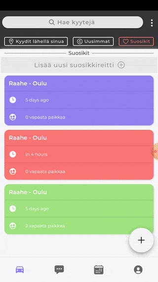

# Share Your Drive

![NPM Version][npm-image]


A cross-platform mobile application for carpooling. Developed as a school project using Ionic, Angular and Firebase.

## Installation

Links:
No app store release yet
Android: Apk can be found in artifacts in this repo.

## Demo




## Development setup

```sh
npm install
ionic serve
```

## Release History

- 0.1.0

  - The app supports auth with using email and password.
  - The app supports creating your drive and sharing it with other users
  - The app supports searching other's people drives by start and finish place.
  - The app supports searching other's people drives near you by your geolocation.
  - The app supports searching by favorite drives.
  - The app supports chating with other users, you can text your driver.
  - The app supports showing drives in calendar view.
  - The app supports profile pictures.

- 0.0.1
  - Work in progress

## Contributing

1. Fork it
2. Create your feature branch (`git checkout -b feature/fooBar`)
3. Commit your changes (`git commit -am 'Add some fooBar'`)
4. Push to the branch (`git push origin feature/fooBar`)
5. Create a new Pull Request

<!-- Markdown link & img dfn's -->

[npm-image]: https://img.shields.io/npm/v/datadog-metrics.svg?style=flat-square
